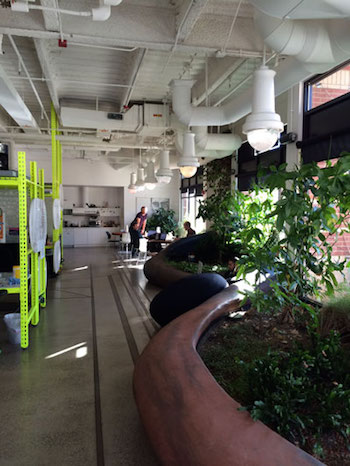
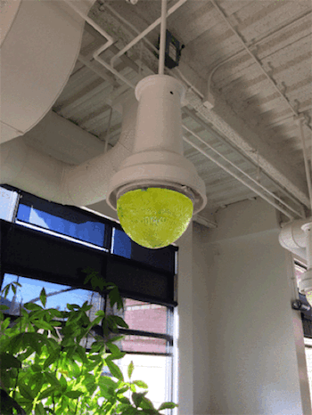
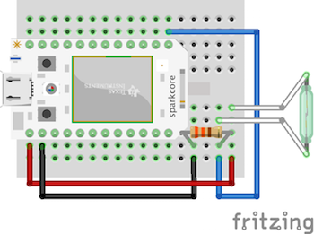
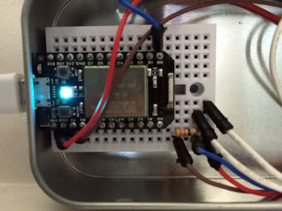

# Ocupado

Ocupado is a wifi enabled bathroom ocupancy detector built using Node.js.

It was built for use at [Quick Left's](http://quickleft.com/?ref=ocupado) Boulder
office in order to prevent people from needing to repeatedly embark on the long
arduous trek to the bathroom only to find it occupied, and subsequently need to
walk back to their desks. :trollface:

When the bathroom occupancy changes, connected [Hue lights](http://meethue.com/)
change colors, messages are posted to [Slack](https://slack.com/), and
the onboard LED is toggled.




### Installation

Clone the Github repo and install dependencies.

```
git clone 'git@github.com:brentertz/ocupado.git'
cd ocupado
npm install
```

### Hardware

The following hardware is used by this project.

* Spark Core - [https://www.spark.io/store](https://www.spark.io/store)
* Door sensor - [http://www.adafruit.com/products/375](http://www.adafruit.com/products/375)
* Mini breadboard - [http://www.adafruit.com/products/65](http://www.adafruit.com/products/65)
* Breadboard wires - [http://www.adafruit.com/products/153](http://www.adafruit.com/products/153)
* 330 Ohm resistor - [https://www.sparkfun.com/products/8377](https://www.sparkfun.com/products/8377)
* Altoids mints sized tin - [http://www.adafruit.com/product/97](http://www.adafruit.com/product/97)
* Phillips Hue - [http://www2.meethue.com/](http://www2.meethue.com/)

Assemble the hardware as shown below.




#### Firmware

Follow [Spark's getting started guide](https://www.spark.io/start) to setup
your Spark Core and connect it to your network.

Visit [http://spark.io/build](http://spark.io/build) or use the
[spark-cli](https://www.npmjs.org/package/spark-cli) to flash your Spark core
with the firmware in `spark/firmware.c`.

### Configuration

Configuration options are stored in `config/default.js`. To override values,
add a gitignored `config/local.js` file.  Note that you can alternatively
override these values with ENV variables. See
[node-config](http://lorenwest.github.io/node-config/0.4.35/) for more
information.

##### Spark

Visit [http://spark.io/build](http://spark.io/build) to obtain your
`apiToken` and `deviceId` and update the configuration respectively.

##### Hue

_Hue integration is optional and can be enabled/disbled via the
`hue.enabled` configuration option._

It is not necessary to perform any special configuration for your Hue, but due
to limitations in the current Hue API it does need to be running on the same
network as this application. (_Yes, I know that there are hacks to work
around this but I chose not to utilize them at this time._)

If you want your Hue to use an existing bridge user account, update the
`hue.username` config value, otherwise the application will create a new
user automatically.

For more information, see [http://www.meethue.com](http://www.meethue.com)

##### Slack

_Slack integration is optional and can be enabled/disbled via the
`slack.enabled` configuration option._

The Slack integration requires that you have set up an __incoming webhook__ on
your Slack account. To do so, login to your slack account, go to integrations,
add new integration, then choose __incoming web hook__.  From here, you can
obtain the required configuration values for `domain` and `token`, as well as
update other settings.

For more information, see [http://www.slack.com](http://www.slack.com)

### Starting the App

_NOTE: If Hue integration is enabled, the first time that you start the app,
you must first press the link button on your Hue bridge._

```
npm start
```

### Hardware Installation

Once you have tested that everything is functional, install the completed
device on the target doorway.
